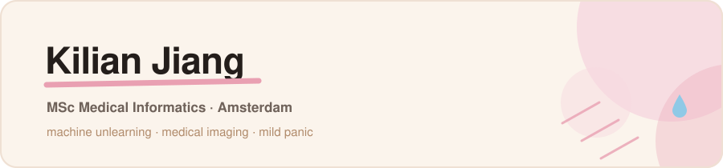

I work on **machine unlearning** — making models forget data they should never
have learned in the first place. Medical imaging and health data the rest of
the time, and a running argument with parallel computing.

 

### Projects

**[Thesis](https://github.com/KkilianJ/Thesis)** 
Analysing 2024 US election data. 

**[MedicalAI_Tutor](https://github.com/KkilianJ/MedicalAI_Tutor)** 
Medical imaging and AI, from the MSc Medical Informatics track. 

